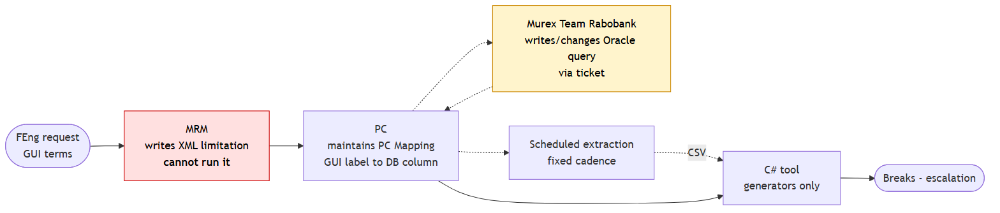
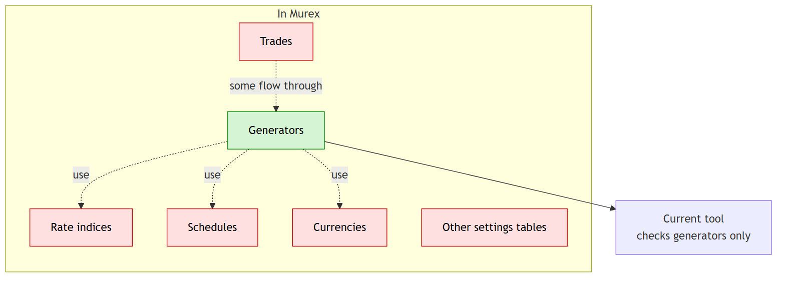
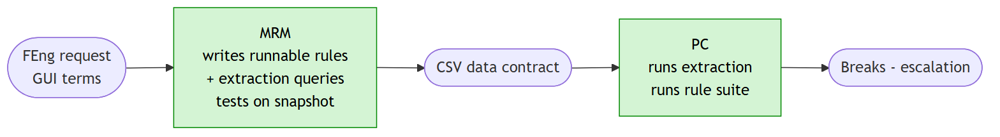

# Case for Rebuilding the MRM Limitation Testing Tool

*Joint MRM / PC submission to the architecture committee.*

## Summary

The recent **ECB finding** on the MRM signoff process surfaces a problem the technical teams have raised internally for some time: limitations are authored by MRM but cannot be tested by MRM. They reach PC unfiltered, are translated a second time into DB terms, and are only verified there — late, partially, and at high cost.

**We ask the committee to authorize a scoped rebuild of the limitation testing tool** — meaning the C# checker, the XML limitation format, and the PC Mapping layer it depends on. The MRM/PC process around it stays. Continued repair of the existing tool will not close the gap.

The case rests on three points:

1. **Authoring is decoupled from verification.** This is the structural cause behind the ECB finding.
2. **The current tool is fragile and partial.** Coverage gaps, ticket-gated DB access, brittleness to GUI changes, and unclear ownership are consequences of how the tool is built, not separate bugs.
3. **Rebuild is feasible — and cheaper than continued repair.** MRM has built a working prototype against a real snapshot. Repair compounds; rebuild does not.

---

## §1 — MRM cannot test what MRM writes

Limitations are written in Murex GUI terms (e.g., *"fixing schedule frequency must be Monthly"*). To check them they must be translated to DB terms. **MRM does this translation once** to produce the limitation. **PC does it again** to run the check. Two teams, two translations, no shared verification step.

The mapping is not one-to-one: the same DB column appears under several GUI surfaces; the same GUI field can collapse into one DB column. Every translation step is an opportunity to lose information. MRM has no way to verify its translation before handover — only PC can run anything.

**Img A — Current flow.** Red = MRM cannot run what it writes. Yellow = ticket-gated waits.



*Source: `img/imgA.mmd`.*

**Img B — One DB column, many GUI surfaces.** The same XML element below maps to *two* DB columns (`EI_FREQ0;EI_FREQ1`, multi-leg) and is rendered under several different GUI paths.

```xml
<fixingSchedule>
    <visibleIf>~/settingsPerLeg_*/schedulesDefinition/fixingSchedule
               == ('Equal to' OR 'Deduced from')</visibleIf>
    <comment>Frequency ratio integer</comment>
    <pcMapping>EI_FREQ0;EI_FREQ1</pcMapping>
    <pcVisibleIf>(fixingSchedule == 'Equal to') OR (fixingSchedule =='Deduced from');
                 ~/settingsPerLeg_*/main/schedulesDefinition/fixingSchedule{1}
                 AS fixingSchedule;</pcVisibleIf>
</fixingSchedule>
```

> _[mx GUI screenshot — Murex Team to insert: same field shown under Leg 1 and Leg 2 settings, with the conditional visibility rule visible.]_

The translation from this XML to a runnable check requires resolving the leg suffix, the conditional visibility, and the GUI-to-DB column mapping — and is repeated independently by MRM (when authoring) and PC (when checking).

This is the gap the ECB finding describes.

---

## §2 — The current tool is fragile and partial

Six weaknesses have surfaced repeatedly in MRM/PC working sessions. They are not independent — they share a root cause in the tool's architecture.

- **Coverage is incomplete.** Only generators are checked. Not every trade flows through a generator. Related objects (rate indices, schedules, currencies) require joins the current tool does not support.
- **DB access is gated by tickets.** Adding or changing an Oracle extraction query requires a ticket to Murex Team (Rabobank). Execution itself is on a fixed schedule, but iteration on rules that need new or finer-grained fields is slow, and queries are not always granular enough for the rule being checked.
- **Vulnerable to GUI changes.** GUI changes have broken validation runs before. Validation logic anchored on GUI labels is exposed to change events MRM does not control.
- **Ownership of `visibleIf` is historically unclear.** Each XML rule carries a `visibleIf` clause declaring whether the field applies to a given product (e.g., a rate-index check is irrelevant on a fixed-rate leg). Whether MRM or PC owns the upkeep of these clauses has never been formally settled. When a clause is wrong, validation either fires on fields that do not apply (false positives) or silently skips fields that do (false negatives).
- **The XML's `<value>` field carries three different meanings.** Sometimes a literal (`Monthly`), sometimes a class reference (`RATEINDEX` — "must exist in this reference table"), sometimes a function call (`[WeakMatchTenor()]`). The reader cannot tell which without knowing the conventions. The specification looks like data but encodes logic.
- **Typology is a Murex artifact, not a model concept.** Validation grouping should align with the Pricing Model Landscape. Today it does not.

**Img C — What the current tool checks vs. what it does not.** Green = checked. Red = not checked.



*Source: `img/imgC.mmd`.* Trades that do not flow through a generator are unverified; objects related to generators (rate indices, schedules, currencies) are not joined into the check.

**The cheaper path is rebuild, not repair.** Each weakness above can be patched in isolation, but every patch sits on the same architecture and inherits the same fragility — the next patch costs the same as the last. A working prototype of the alternative architecture (§3) already exists; it cost less to build than several of the maintenance items above have cost to live with. Continued repair is, today, the more expensive option.

---

## §3 — Rebuild is feasible

Before asking the committee to commit, MRM built a small prototype: **extract → SQL rules → break report**. It runs end-to-end against a real one-month-old snapshot, across all in-scope typologies, on a laptop with no infrastructure dependencies.

It is **not a proposed product.** It is evidence that the failure modes in §1 and §2 are properties of the current implementation, not inherent to validation work.

**Img D — Target flow.** MRM authors and tests in the same step. The boundary between MRM and PC is a stable CSV data contract, not a sequence of tickets.



*Source: `img/imgD.mmd`.*

---

## What we ask

The committee is asked to authorize:

1. A **scoping exercise** for the rebuild, covering boundaries and the ownership split between MRM and PC.
2. A **formal requirements pass** on validation expectations beyond the current generator scope.
3. A **target timeline.**

We are not asking for tool selection or implementation approval at this stage.

---

## Appendix A — On quantifying the gap

The committee may reasonably ask how large the validation gap is today. We can quantify *known* breaks — PC's break report is attached separately. We cannot quantify the unknowns: the only tool capable of measuring the current tool's blind spots is the current tool itself. The inability to self-measure is, on its own, an argument for rebuild.

## Appendix B — Glossary

- **Limitation** — a rule defining allowed values of a Murex field for a given product or generator type.
- **Generator** — a Murex template configuration that trades inherit from.
- **Typology** — a Murex grouping of product types (IRS, OIS, Loan Deposit, etc.).
- **PC Mapping** — the table linking GUI field labels to extracted DB columns, currently maintained by PC.
- **Signoff** — formal record that a field's allowed values have been approved by MRM.
